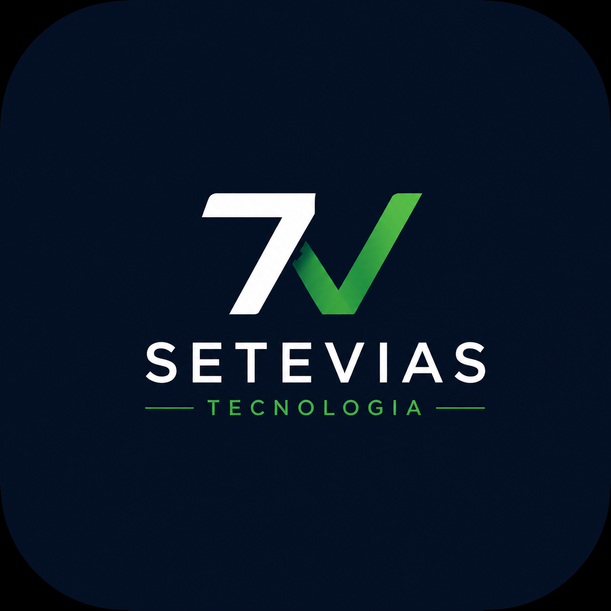

  

<h1 align="center">SETEVIAS TECNOLOGIA</h1>

  <strong>Tecnologia que sustenta, protege e impulsiona negócios.</strong>

---

## 🚀 Sobre a Setevias

A **Setevias Tecnologia** oferece soluções de tecnologia para empresas que precisam de infraestrutura confiável, segurança, automação e presença digital.

Atuamos desde a sustentação de ambientes críticos até projetos de transformação e presença digital para pequenos e médios negócios.

Nosso objetivo é simples:

> **Usar tecnologia para tornar empresas mais seguras, eficientes, disponíveis e preparadas para crescer.**

---

## 🧭 Nossas Soluções

### 🐧 Linux & Infraestrutura

Administração, sustentação e troubleshooting de ambientes Linux, servidores, serviços e infraestrutura corporativa.

### ☁️ Cloud & Multi-Cloud

Soluções e administração de ambientes em **AWS, Microsoft Azure, Google Cloud e Oracle Cloud Infrastructure (OCI)**.

### ⚙️ DevOps & Automação

Automação de infraestrutura, provisionamento, containers e melhoria de processos utilizando tecnologias como:

`Ansible` • `Terraform` • `Docker` • `Kubernetes` • `Git` • `CI/CD`

### 📊 Monitoramento & Observabilidade

Monitoramento de infraestrutura e aplicações, análise de disponibilidade, métricas e troubleshooting.

`Zabbix` • `Grafana` • `Logs` • `Observabilidade`

### 🛡️ Segurança da Informação

Hardening de servidores, análise de vulnerabilidades, proteção de ambientes, análise de logs e apoio técnico em incidentes.

### 🔎 Perícia Digital

Análise técnica de evidências digitais, logs, sistemas e informações relacionadas a incidentes e investigações digitais.

### 🌐 Presença Digital

Soluções para empresas que desejam aumentar sua presença e visibilidade na internet:

**Sites Institucionais • Domínio Profissional • SEO • Google • Localização • WhatsApp • E-mail Profissional**

---

## 💼 Para empresas de todos os tamanhos

Atendemos desde **pequenos e médios negócios** que precisam iniciar ou profissionalizar sua presença digital até empresas que necessitam de **especialistas em Linux, infraestrutura, Cloud, DevOps e Segurança**.

---

## 🛠️ Tecnologias

`Linux` `Red Hat` `Ubuntu` `Debian` `SUSE`

`AWS` `Azure` `GCP` `OCI`

`Docker` `Kubernetes` `Terraform` `Ansible`

`Zabbix` `Grafana`

`Nginx` `Apache` `Tomcat` `WebLogic`

`Git` `CI/CD` `Python`

---

## 📬 Fale com a Setevias

🌐 **Site:** https://setevias.tec.br/

📧 **E-mail:** contato@setevias.com.br

📱 **WhatsApp:** (11) 96519-745

📍 **São Paulo - SP | Atendimento remoto para todo o Brasil**

---

### 7V • SETEVIAS TECNOLOGIA

**Tecnologia por todos os caminhos.**

© 2026 Setevias Consultoria em TI. Todos os direitos reservados.

